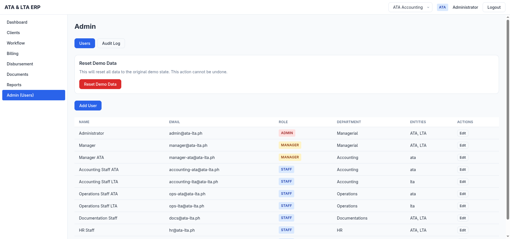

# ATA & LTA Accounting Firm ERP



A modern, responsive Enterprise Resource Planning (ERP) prototype designed specifically for dual-entity accounting firms (ATA & LTA). This application provides a unified dashboard and robust modules for managing workflows, billing, disbursements, and document handovers, wrapped in a clean, "Trust Blue & Slate" corporate financial UI.

---

## 🚀 Key Features

### 🏢 Dual-Entity Management
*   **Entity Switching**: Seamlessly toggle between "ATA Accounting" and "LTA Accounting" workspaces.
*   **Role-Based Access Control**:
    *   **Admin/Manager**: Bird's-eye view of all entity data, workflows, and performance metrics.
    *   **Staff**: Encapsulated view. Staff only see clients, work requests, and documents related to their assigned entity and tasks.

### 📊 Modern Bento-Grid Dashboard
*   **Consolidated KPIs**: View aggregated revenue, outstanding balances, and active work requests.
*   **SVG Charts**: Responsive, smooth SVG line and donut charts showing volume trends and revenue splits.
*   **Full-Screen Responsive Layout**: Adjusts beautifully from 4k desktop monitors down to mobile views.

### 🔄 Intelligent Workflow & Tasks
*   **Work Requests**: Track the end-to-end lifecycle of client requests (Pre-processing -> Processing -> Billing -> Disbursement -> Documentation).
*   **Task Dependencies**: Define predecessor and dependent tasks for logical flow.
*   **Visual Assignees**: Instantly recognize who is working on what with stock photo avatar integrations.

### 💰 Billing & Disbursement
*   **Invoicing**: Generate detailed Sales Invoices with automatic VAT calculations and aging reports.
*   **Disbursement Approvals**: Configurable 1-tier or 2-tier approval workflows depending on the role. Prevents self-approval of expenses.
*   **Fund Sources**: Track whether expenses are billed to the Firm Fund or the Client Fund.

### 📁 Document Management (DMS)
*   **Version Control**: Track document versions, uploaders, and timestamps.
*   **Handover Logs**: Maintain a secure chain of custody with integrated physical/digital handover tracking.

---

## 🛠 Tech Stack

This prototype is built using a lightweight, pure frontend architecture for high-speed demonstration and conceptual validation:

*   **HTML5**
*   **CSS3**: Custom Neumorphic "Soft UI" using CSS Variables (No external frameworks like Tailwind/Bootstrap required).
*   **Vanilla JavaScript (ES6)**: Modular structure (`app.js`, `billing.js`, `workflow.js`, etc.).
*   **Local Storage DB**: Uses browser `localStorage` to simulate backend persistence (`data.js`).

---

## 💻 Getting Started

Because this is a pure frontend prototype utilizing `localStorage`, there is no complex build step or backend to configure.

1. **Clone the repository:**
   ```bash
   git clone https://github.com/your-username/ata-lta-erp.git
   cd ata-lta-erp
   ```

2. **Serve the application:**
   You can use any basic HTTP server to run the app. 
   
   *Using Python:*
   ```bash
   python -m http.server 8080
   ```
   
   *Using Node.js (http-server):*
   ```bash
   npx http-server -p 8080
   ```

3. **Login Accounts:**
   Navigate to `http://localhost:8080` in your browser. You can use any of the mock accounts defined in `js/data.js`. 
   
   **Default Password for all accounts:** `password123`
   
   *   **Admin**: `admin@ata-lta.ph` (Full Access)
   *   **Manager**: `manager@ata-lta.ph` (Full Access)
   *   **Staff ATA**: `accounting-ata@ata-lta.ph` (ATA Only)
   *   **Staff LTA**: `ops-lta@ata-lta.ph` (LTA Only)

---

## 🎨 Design System

The application utilizes a **Trust Blue & Slate** color scheme, tailored for classic financial technology:

*   **Primary (Trust Blue)**: `#2563eb`
*   **Secondary (Slate)**: `#475569`
*   **Background (Panel)**: `#f4f6fb`
*   **Typography**: `Poppins` sans-serif

---

*Developed for ATA & LTA Accounting Firm.*